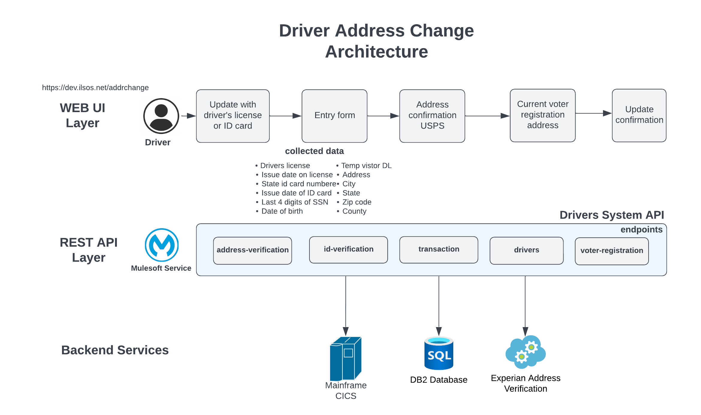

# ilsos-drivers-sapi

<br>

Drivers System API

## Table of contents
1. [Description](#description)
1. [Endpoints](#endpoints)
    1. [PUT /address-change](#put-address-change)
    1. [PUT /id-validation](#put-id-validation)
    
    
           

## Description
The API provides the backend services for the Drivers Address Change business case. The next diagram shows the architecture



This service implements the next API specification: https://anypoint.mulesoft.com/exchange/0fa744b1-1284-46c5-b23c-0eb98ea787e3/ilsos-drivers-sapi/minor/1.0/

## Endpoints
The service provides the next endpoints:

### PUT /address-change
Update the driver address.

The next diagram shows the business sequence of messages or events exchanged between the several backend systems.

```mermaid
sequenceDiagram
    autonumber
    participant eapi as ilsos-addresschange-eapi
    participant api as ilsos-drivers-sapi
    participant db2 as DB2
    participant mainframe as MainFrame

    eapi->>api:PUT/address-change <br>Input:vin,dept,addrverifification(boolean),beginTransDatetime<br>dl,Id,last4ssn,DOB<br>street,city,state,zipCode, county,<br>countyCode,trueClientIP,dlIssueDate,IdIssueDate and tvdl

    note over db2:DP_ADDRCHG_TRANS
    note over mainframe:CICS:dsf02gOut
    api-->>api:Dataweave - format records for db2<BR> DP_ADDRCHG_TRANS TABLE.<br>Input:vin,dept,addrverifification(boolean),beginTransDatetime<br>dl,Id,last4ssn,<br>street,city,state,zipCode,county,<br>countyCode,trueClientIP,dlIssueDate,IdIssueDate and tvdl
    api-->>db2:Update
    api-->>api:Log response. If db2 access error, then send email to admin
    alt Error Scenario 
        api-->eapi: Status 400 or 500 , detail error message
    end
    api-->>api:Dataweave - format records for mainframe CICS(dsf02gOut)<br> Input:idTransaction("DSF1" or "DSF2")addrverification(boolean),dl,Id,dob<br>street,city,state,zipCode, county,<br>and voter registration(Y or N)
    api-->>mainframe:Update driver record
    mainframe-->>api:Retrieve CICS code.
    api-->>api:Log response. If mainframe access error, then send email to admin<br>anything other then 0 is error from cics
    alt Success Scenario 
        api-->eapi: Status 200 
    end
    alt Error Scenario 
        api-->eapi: Status 400 or 500 , cics error code
    end
  ```


### PUT /id-validation
Validates the drivers license or state ID.

```mermaid
sequenceDiagram
    autonumber
    participant eapi as ilsos-addresschange-eapi
    participant api as ilsos-drivers-sapi
    participant mainframe as MainFrame
    
    eapi->>api:PUT/id-validation <br>Input: dl,Id and last4ssn
    note over mainframe:CICS:dsf02gOut
    api-->>api:Dataweave - format records for mainframe CICS(dsf02gOut).
    api-->>mainframe:Validate input data.
    mainframe-->>api:Retrieve CICS code.
    api-->>api:Log response. If mainframe access error, then send email to admin
    alt Success Scenario 
        api-->eapi: Status 200
    end
    alt Error Scenario 
        api-->eapi: Status 400 or 500, cics error code 
    end
```
